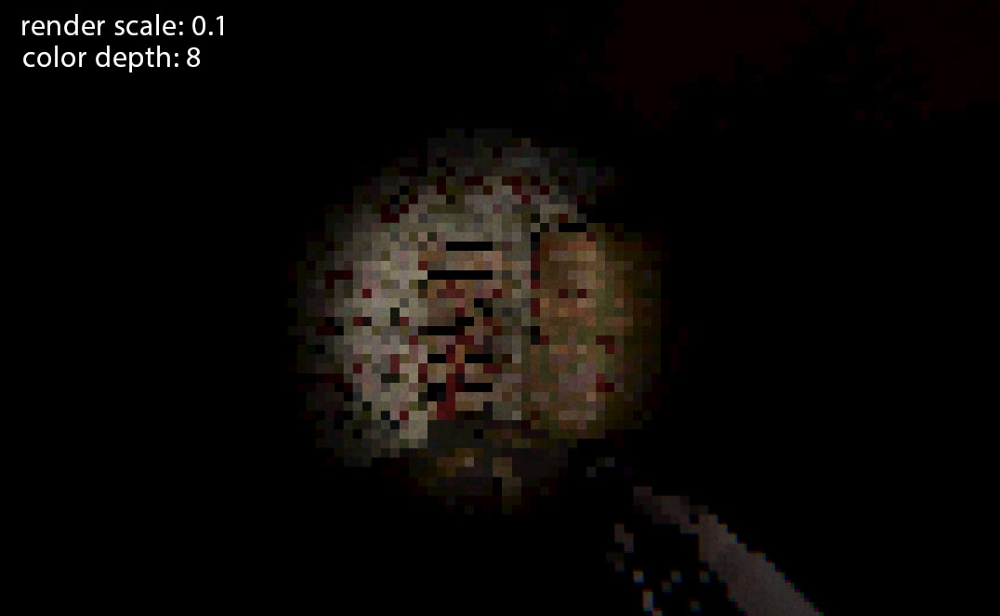
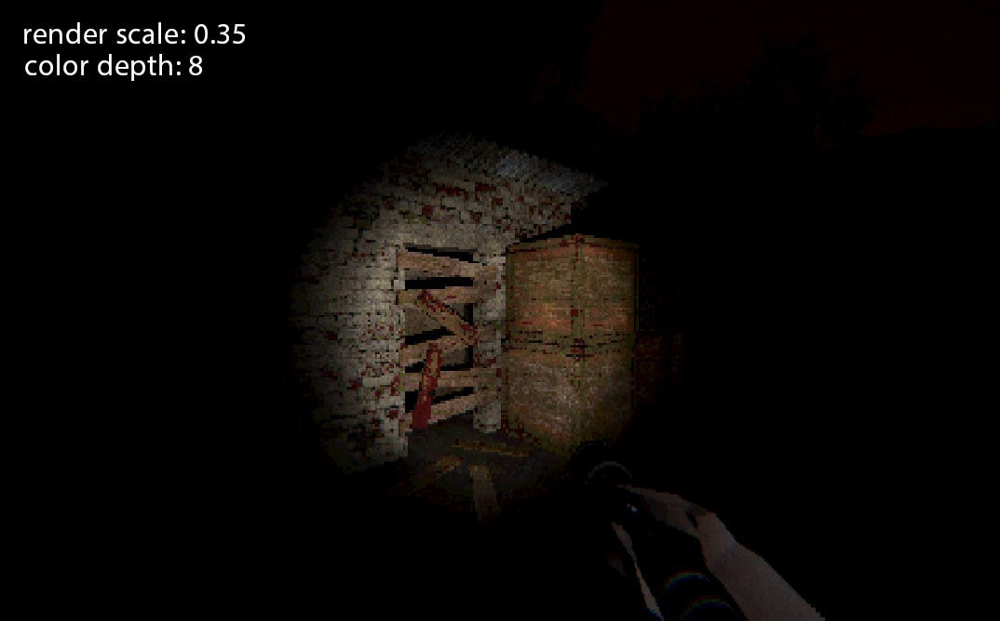
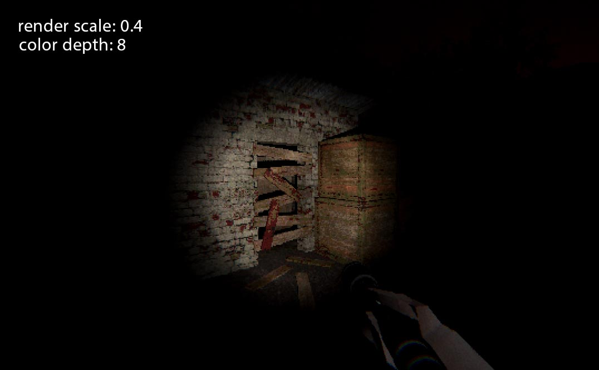
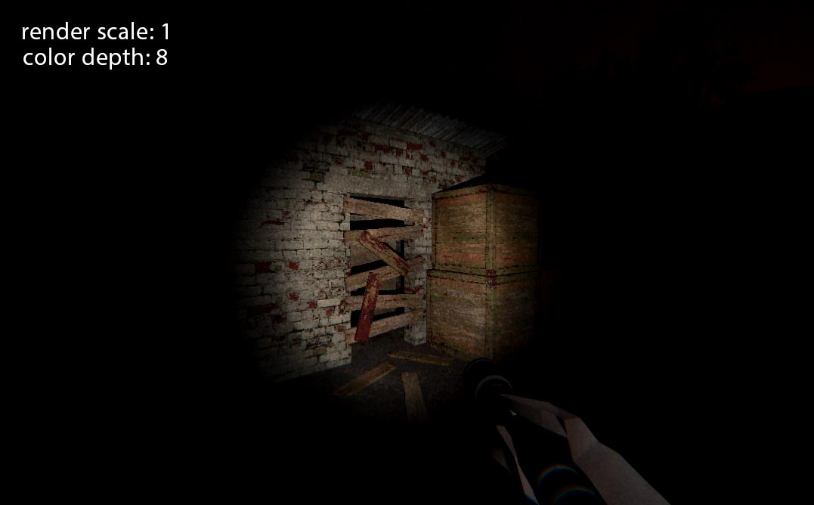

# PSX Pixelization — Unity 6 URP

A custom fullscreen post-processing effect for Unity 6 (Universal Render Pipeline) that recreates the low-resolution, color-crushed look of PlayStation 1 era graphics.

Built as a proper URP Volume override, so you can control it per-scene, blend between volumes, and animate parameters at runtime — just like any built-in post-processing effect.

## Features

- **Resolution downscaling** — Render at a fraction of the screen resolution (default 0.35x) and upscale with point filtering for that chunky pixel look
- **Color depth reduction** — Reduce bits per channel to simulate PSX color banding (set to 5-8 for authentic results)
- **Volume integration** — Works as a standard URP Volume override, supports blending and per-camera control
- **Non-destructive** — Runs before post-processing, so bloom, color grading, and other effects still apply on top

## Requirements

- Unity 6 (6000.0+)
- Universal Render Pipeline

## Installation

1. Copy the `Assets/Scripts/Rendering/` folder into your project
2. Select your URP Renderer Asset (e.g. `PC_Renderer`)
3. Click **Add Renderer Feature** → **PSX Pixelization Feature**
4. The shader auto-resolves. If it doesn't, drag `PSXPixelization.shader` into the shader slot

## Usage

1. Select your **Global Volume** (or create one: GameObject → Volume → Global Volume)
2. In the Volume Profile, click **Add Override** → **Post-processing** → **PSX Pixelization**
3. Enable the override and check **Enabled**
4. Adjust parameters:

| Parameter | Range | Default | Description |
|-----------|-------|---------|-------------|
| Enabled | on/off | off | Toggle the effect |
| Render Scale | 0.05 – 1.0 | 0.35 | Resolution multiplier. Lower = more pixelated |
| Color Depth | 2 – 32 | 32 | Bits per channel. Lower = more color banding |

## Preview

